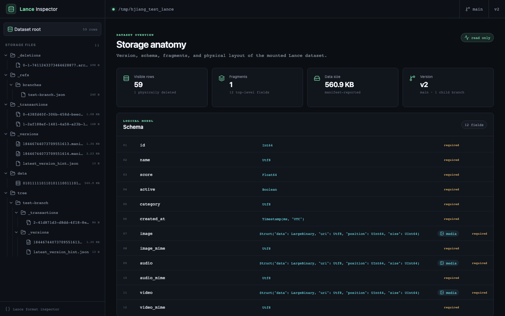
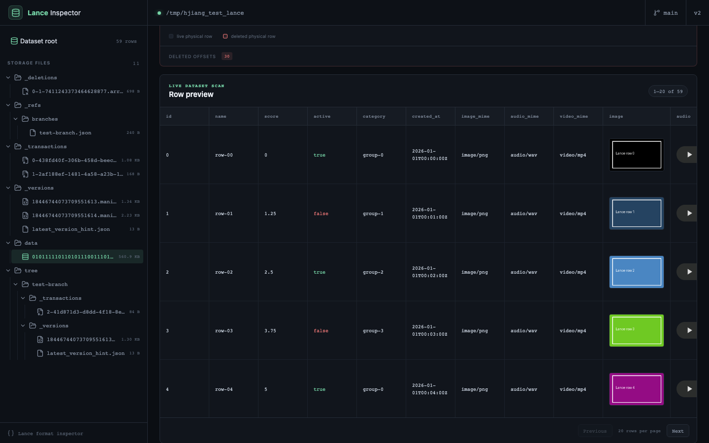
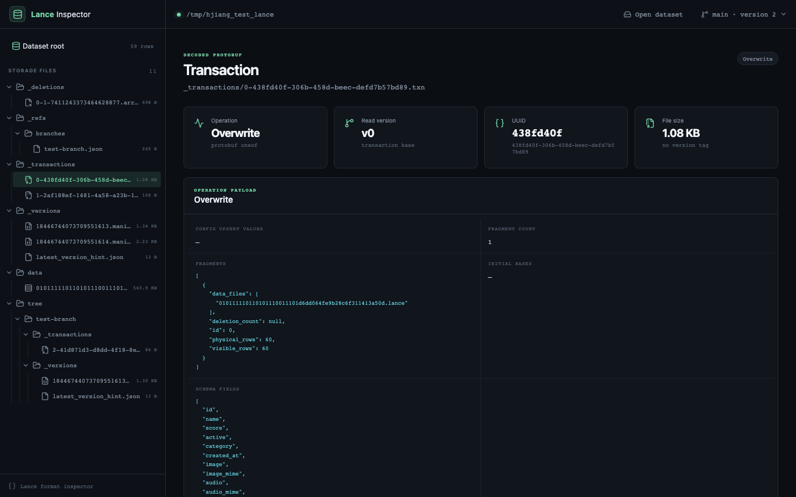
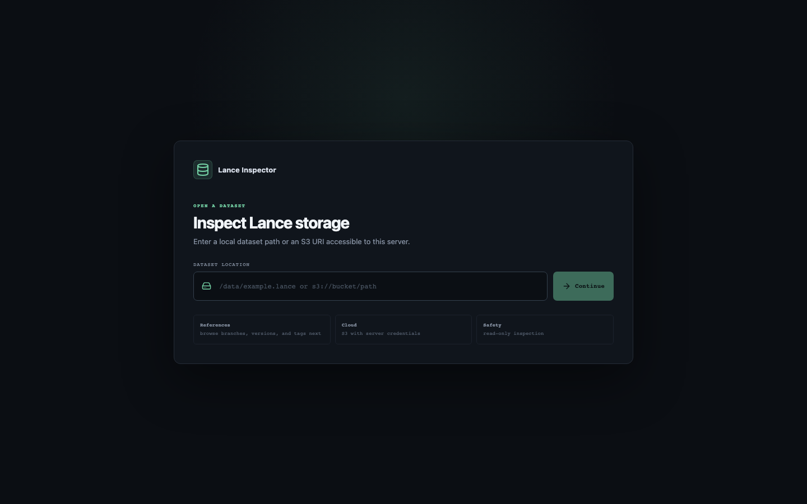

# Lance Inspector

Lance Inspector is a read-only web application for understanding what is
physically stored inside a Lance dataset. It connects the logical table view
with manifests, fragments, transactions, deletion vectors, snapshot lineage,
and the underlying object hierarchy.

It runs locally, in Docker, or on Kubernetes against a mounted dataset or an S3
URI. No database or catalog service is required.



## Who it is for

- **Lance maintainers and infrastructure engineers** investigating storage
  layout, version history, commit behavior, or corrupted datasets.
- **Data platform and SRE teams** validating datasets in local environments,
  pipelines, object storage, and Kubernetes.
- **Advanced Lance users and data engineers** who need to connect table rows
  with fragments, data files, deletion vectors, and branches.
- **Multimodal ML teams** validating image, audio, and video values stored as
  Lance Blob V2 columns.

It is an internal inspection and debugging tool, not a general-purpose BI
dashboard or dataset editor.

## What it achieves

- Browses the real dataset hierarchy, including `data/`, `_versions/`,
  `_transactions/`, `_deletions/`, `_indices/`, `_refs/`, and branch storage
  under `tree/`.
- Decodes the active binary manifest into human-readable schema, version,
  feature-flag, fragment, storage-format, and base-path information.
- Decodes protobuf transaction files and summarizes operations such as
  `Overwrite`, `Delete`, `Append`, `Clone`, and `Restore`.
- Shows physical and visible row counts for each fragment.
- Visualizes deletion vectors as physical-row grids and explicit deleted
  offsets instead of silently hiding tombstones.
- Previews live rows in pages of 20 and renders Blob V2 images, audio, and video
  with native browser controls.
- Supports HTTP byte ranges for efficient media streaming.
- Uses the same Lance object-store integration for local paths and S3.
- Discovers snapshot lineage before opening a dataset: branches, version
  histories, fork points, timestamps, row counts, and tags.
- Opens any discovered branch version or tag directly and switches snapshots
  from the loaded-dataset header.
- Exposes no mutation endpoints and is designed to run with read-only storage.

### Multimodal row inspection



### Human-readable transaction history



## Current scope

The inspector displays lineage for dataset snapshots and inspects one selected
snapshot at a time. Users can open or switch datasets and references from the
browser without restarting the server. Row previews show live rows, while
deleted physical offsets are presented in the associated fragment's
deletion-vector view. Media rendering currently targets Lance Blob V2 columns.

Snapshot lineage currently covers branch ancestry, manifest versions, and
tags. It does not yet provide column-level or row-level provenance across
versions.

Dataset locations are opened with the server's filesystem and cloud
credentials. Deploy the inspector only for trusted users or place it behind
your normal authentication layer.

## Architecture

- **Backend:** Rust, Axum, and the native Lance crates.
- **Frontend:** React, TypeScript, and Vite.
- **Storage:** local filesystems and S3 through Lance's object-store layer.
- **Deployment:** one stateless container serving both the API and built UI.

## Run locally

Prerequisites: Rust 1.97+, Node.js 24+, and npm.

```bash
cd frontend
npm install
npm run build
cd ..

cargo run --manifest-path backend/Cargo.toml
```

Open [http://localhost:8080](http://localhost:8080), enter a local path such as
`/tmp/hjiang_test_lance` or an S3 URI, and select **Continue**. The inspector
then lists the dataset's branches, versions, and tags so you can choose a
snapshot without knowing its reference name in advance.



## Browse snapshot lineage

After reading the dataset location, the landing flow displays each branch and
its manifest-version history. Every version shows its timestamp, row count when
available, and associated tags. A branch also identifies the parent branch and
version from which it forked, making branch ancestry visible without inspecting
the `_refs` files manually.

Select any version or tag to open that immutable dataset snapshot. The file
hierarchy, manifest, fragments, rows, transactions, deletion vectors, and media
previews then reflect that selected snapshot.

After a dataset loads, the header shows the checked-out branch and resolved
manifest version, for example **main · version 2**. Select it to open the same
lineage browser as a dropdown overlay and switch snapshots without entering the
dataset location again or restarting the server.

The same workflow is available through Make:

```bash
make build
make run
```

For frontend hot reload, keep the backend running and start Vite in a second
terminal:

```bash
cd frontend
npm run dev
```

Then open [http://localhost:5173](http://localhost:5173). Vite proxies `/api`
to the backend on port 8080.

## Inspect a dataset on S3

Enter an `s3://bucket/path/example.lance` URI in the browser. Lance uses the
server's standard AWS environment variables, credential files, instance roles,
or Kubernetes workload identity.

## Docker

```bash
docker build -t lance-inspector .
docker run --rm -p 8080:8080 \
  -v /tmp/hjiang_test_lance:/data/dataset:ro \
  lance-inspector
```

Enter `/data/dataset` in the browser. For S3, omit the volume and provide your
normal AWS credential or workload-identity configuration.

## Kubernetes

[`deploy/kubernetes.yaml`](deploy/kubernetes.yaml) contains a Deployment and
Service example. Replace the image, dataset URI, and sample `hostPath` with a
PVC/CSI mount or an S3 URI before applying it.

```bash
kubectl apply -f deploy/kubernetes.yaml
kubectl port-forward service/lance-inspector 8080:80
```

## API

- `GET /api/dataset` — schema, active manifest, fragments, branches, deletions
- `POST /api/dataset/references` — discover branches, versions, and tags for a dataset
- `POST /api/dataset/connect` — open a local/S3 dataset at a branch, version, or tag
- `GET /api/files` — recursive storage hierarchy for local paths or S3
- `GET /api/transaction?path=...` — decoded protobuf transaction and operation
- `GET /api/rows?offset=0&limit=20` — paginated live-row preview
- `GET /api/media/:column/:row_address` — range-enabled Blob V2 streaming
- `GET /api/file?path=...` — bounded text/hex preview for internal files
- `GET /api/health` — health check
