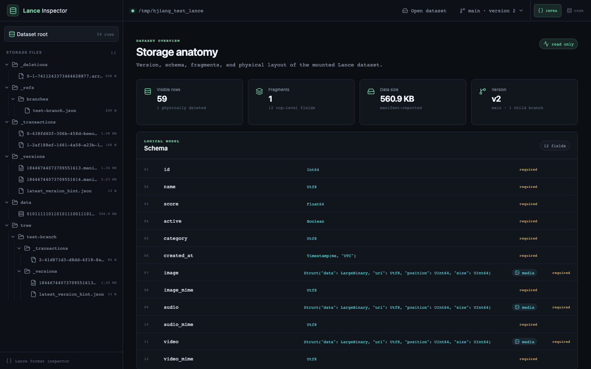
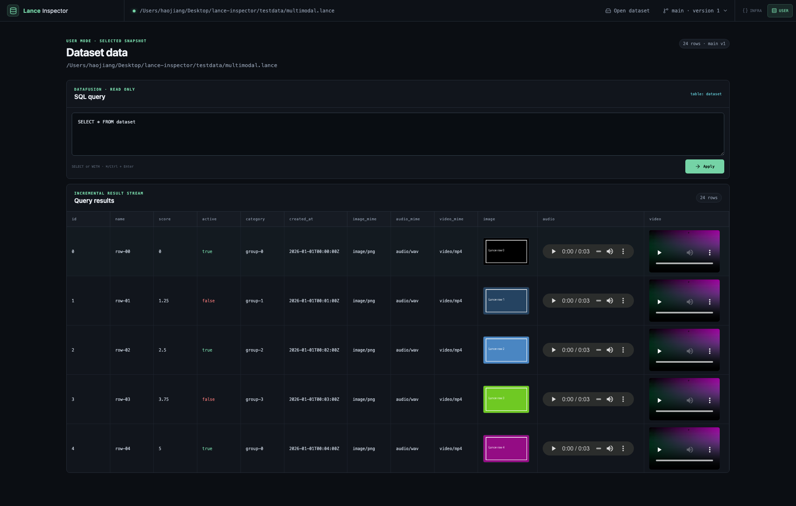
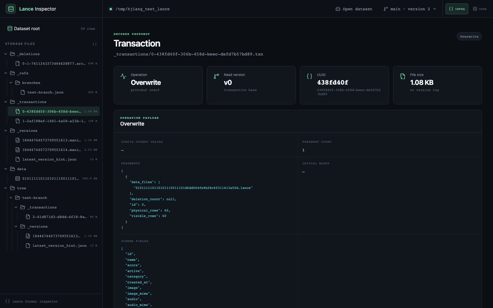
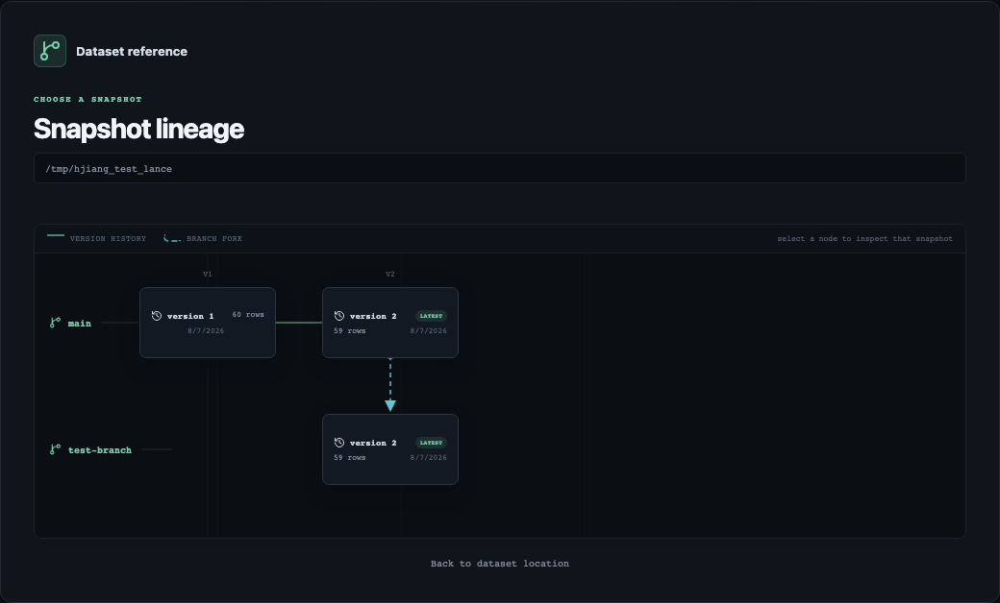
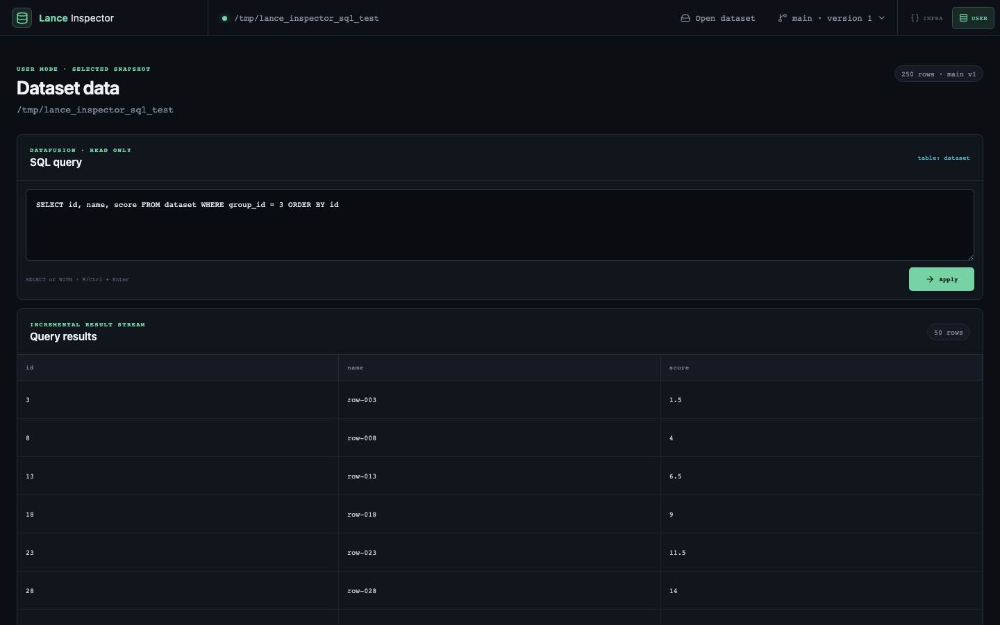

# Lance Inspector

Lance Inspector is a read-only web application for understanding what is
physically stored inside a Lance dataset. It connects the logical table view
with manifests, fragments, transactions, deletion vectors, snapshot lineage,
and the underlying object hierarchy.

It runs locally, in Docker, or on Kubernetes against a mounted dataset or an S3
URI. No database or catalog service is required.



## Who it is for

- **Lance maintainers and infrastructure engineers** investigating storage
  layout, version history, commit behavior, or corrupted datasets.
- **Data platform and SRE teams** validating datasets in local environments,
  pipelines, object storage, and Kubernetes.
- **Advanced Lance users and data engineers** who need to connect table rows
  with fragments, data files, deletion vectors, and branches.
- **Multimodal ML teams** validating image, audio, and video values stored as
  Lance Blob V2 columns.

It is an internal inspection and debugging tool, not a general-purpose BI
dashboard or dataset editor.

## What it achieves

- Browses the real dataset hierarchy, including `data/`, `_versions/`,
  `_transactions/`, `_deletions/`, `_indices/`, `_refs/`, and branch storage
  under `tree/`.
- Decodes the active binary manifest into human-readable schema, version,
  feature-flag, fragment, storage-format, and base-path information.
- Decodes protobuf transaction files and summarizes operations such as
  `Overwrite`, `Delete`, `Append`, `Clone`, and `Restore`.
- Shows physical and visible row counts for each fragment.
- Visualizes deletion vectors as physical-row grids and explicit deleted
  offsets instead of silently hiding tombstones.
- Previews live rows in pages of 20 and renders Blob V2 images, audio, and video
  with native browser controls.
- Defers Blob media requests until their table cells approach the visible
  scroll area, so offscreen Blob bytes are not read eagerly.
- Supports HTTP byte ranges for efficient media streaming.
- Uses the same Lance object-store integration for local paths and S3.
- Renders snapshot lineage as an interactive graph with branch lanes, version
  nodes, commit edges, fork edges, timestamps, row counts, and tags.
- Opens any discovered branch version or tag directly and switches snapshots
  from the loaded-dataset header.
- Provides an **Infra** mode for storage internals and a data-only **User** mode
  with streaming, read-only SQL over the selected snapshot.
- Exposes no mutation endpoints and is designed to run with read-only storage.

### Multimodal row inspection



### Human-readable transaction history



## Current scope

The inspector displays lineage for dataset snapshots and inspects one selected
snapshot at a time. Users can open or switch datasets and references from the
browser without restarting the server. Row previews show live rows, while
deleted physical offsets are presented in the associated fragment's
deletion-vector view. Media rendering currently targets Lance Blob V2 columns.

Snapshot lineage currently covers branch ancestry, manifest versions, and
tags. It does not yet provide column-level or row-level provenance across
versions.

Dataset locations are opened with the server's filesystem and cloud
credentials. Deploy the inspector only for trusted users or place it behind
your normal authentication layer.

## Architecture

- **Backend:** Rust, Axum, and the native Lance crates.
- **Frontend:** React, TypeScript, and Vite.
- **Storage:** local filesystems and S3 through Lance's object-store layer.
- **Deployment:** one stateless container serving both the API and built UI.

## Run locally

Prerequisites: Rust 1.97+, Node.js 24+, and npm.

```bash
cd frontend
npm install
npm run build
cd ..

cargo run --manifest-path backend/Cargo.toml
```

Open [http://localhost:8080](http://localhost:8080), enter a local path such as
`/tmp/hjiang_test_lance` or an S3 URI, and select **Continue**. The inspector
then visualizes the dataset's branches, versions, fork points, and tags so you
can choose a snapshot without knowing its reference name in advance.

## Web workflow

### 1. Open a dataset

The landing page asks only for a dataset location. Reference selection happens
after Lance has discovered the dataset's actual branch and version metadata.


### 2. Choose a snapshot from the lineage graph

After reading the dataset location, the landing flow displays each branch and
its manifest-version history. Every version shows its timestamp, row count when
available, and associated tags. Solid edges connect versions on the same branch;
curved fork edges connect a child branch to its exact parent-version node. This
makes branch ancestry visible without inspecting the `_refs` files manually.



Select any version or tag to open that immutable dataset snapshot. The file
hierarchy, manifest, fragments, rows, transactions, deletion vectors, and media
previews then reflect that selected snapshot.

### 3. Inspect and switch snapshots

After a dataset loads, the header shows the checked-out branch and resolved
manifest version, for example **main · version 2**. Select it to reopen the same
lineage graph in an overlay and switch snapshots without entering the dataset
location again or restarting the server.

### 4. Switch interface modes

The top-right mode control defaults to **User**:

- **Infra** shows the complete storage inspector: hierarchy, manifests,
  fragments, transactions, deletion vectors, raw files, row previews, and
  read-only SQL.
- **User** removes the storage hierarchy and internal metadata views. It shows
  a SQL editor plus the rows and multimodal values returned from the exact
  branch and version selected in the header.

Switching modes does not change the selected dataset snapshot.



### Cursor-paginated SQL

Both modes run DataFusion SQL against a read-only table named `dataset`. The
default query is:

```sql
SELECT * FROM dataset
```

Only `SELECT` and `WITH` queries are accepted. Each query runs once and creates
a server-side cursor. The browser pulls 100 rows at a time from that cursor as
the user scrolls, retaining at most 10,000 rows. Page sequence numbers make
retries idempotent after a network timeout; applying another query or switching
snapshots cancels the previous cursor.

The query lifecycle is:

1. `POST /api/sql/start` builds the DataFusion query once, stores its
   forward-only `RecordBatch` stream, and returns an opaque cursor ID plus the
   result schema.
2. `GET /api/sql/:cursor_id/page?sequence=N` advances that same stream until it
   has at most 100 rows. It does not rerun the SQL or use `OFFSET`.
3. The backend caches the most recently completed page before returning it.
   Retrying the same sequence therefore returns identical rows without
   advancing DataFusion twice.
4. `POST /api/sql/:cursor_id/cancel` releases the stream when a query is
   replaced, its snapshot changes, or its view is closed.

This bounds application-layer work to the current Arrow batch, pending rows,
and one cached response rather than collecting the complete result. It does not
change SQL operator semantics: `ORDER BY`, joins, and aggregations may still
need DataFusion to read or materialize substantial intermediate state before
the first page is available.

#### Cursor failure handling

- A lost HTTP response or transient client-to-server network failure is
  recoverable: the client retries the same sequence and receives the cached
  page.
- A DataFusion, Arrow projection, or row-serialization failure invalidates and
  removes the cursor. The API returns `422 Unprocessable Entity`, and the UI
  offers **Rerun query** rather than retrying a terminal stream.
- An unknown, cancelled, or idle-expired cursor returns `404 Not Found`; rerun
  the query to create a new cursor.
- An expired dataset connection returns `410 Gone`; reconnect the dataset
  before running SQL again.
- Backend restarts are not resumable because cursor state is currently
  in-memory.

Cursors are isolated by dataset connection, limited to 256 server-wide, and
expire after ten idle minutes. Only the latest page is retained for idempotent
retry because the browser issues one sequential request at a time.

Blob values remain independent: SQL pages contain scalar values, MIME columns,
and `_rowaddr`, while media bytes are requested only when their result cells
approach the visible scroll area. If selecting Blob columns explicitly, also
select `_rowaddr` and the corresponding MIME column.

The browser currently retains fetched scalar rows up to the 10,000-row cap.
Row virtualization and byte-bounded page caching remain follow-up work for
large or unusually wide query results.

The same workflow is available through Make:

```bash
make build
make run
```

For frontend hot reload, keep the backend running and start Vite in a second
terminal:

```bash
cd frontend
npm run dev
```

Then open [http://localhost:5173](http://localhost:5173). Vite proxies `/api`
to the backend on port 8080.

## Inspect a dataset on S3

Enter an `s3://bucket/path/example.lance` URI in the browser. Lance uses the
server's standard AWS environment variables, credential files, instance roles,
or Kubernetes workload identity.

## Docker

```bash
docker build -t lance-inspector .
docker run --rm -p 8080:8080 \
  -v /tmp/hjiang_test_lance:/data/dataset:ro \
  lance-inspector
```

Enter `/data/dataset` in the browser. For S3, omit the volume and provide your
normal AWS credential or workload-identity configuration.

## Kubernetes

[`deploy/kubernetes.yaml`](deploy/kubernetes.yaml) contains a Deployment and
Service example. Replace the image and sample `hostPath` with a PVC/CSI mount,
or enter an S3 URI from the web UI after deployment.

```bash
kubectl apply -f deploy/kubernetes.yaml
kubectl port-forward service/lance-inspector 8080:80
```

## API

- `POST /api/dataset/references` — discover branches, versions, and tags, returning an opaque `discovery_id`
- `POST /api/dataset/connect` — select a snapshot through its `discovery_id`, reusing the opened dataset and returning an opaque `connection_id`
- `GET /api/dataset?connection_id=...` — schema, active manifest, fragments, branches, deletions
- `POST /api/sql/start?connection_id=...` — execute read-only SQL once and create a cursor
- `GET /api/sql/:cursor_id/page?connection_id=...&sequence=...` — retrieve an idempotent 100-row page
- `POST /api/sql/:cursor_id/cancel?connection_id=...` — cancel and release a query cursor
- `GET /api/files?connection_id=...` — recursive storage hierarchy for local paths or S3
- `GET /api/transaction?connection_id=...&path=...` — decoded protobuf transaction and operation
- `GET /api/rows?connection_id=...&offset=0&limit=20` — paginated live-row preview
- `GET /api/media/:column/:row_address?connection_id=...` — range-enabled Blob V2 streaming
- `GET /api/file?connection_id=...&path=...` — bounded text/hex preview for internal files
- `GET /api/health` — health check

Connections are isolated per browser tab, bounded on the server, and expire
after one hour without access. Reconnect the dataset after a `410 Gone`
response.

SQL cursors expire after ten idle minutes and are also bounded on the server.
Rerun the query after a cursor-expired response or DataFusion execution failure;
page retry is reserved for transport failures while the cursor remains valid.
